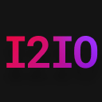
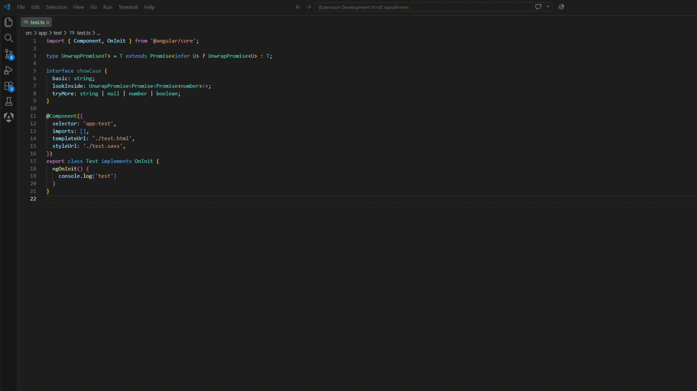

# Angular Interface to IO

<p align="center">
  
</p>

Generate Angular signal boilerplate from TypeScript interfaces in seconds.

This extension transforms interface fields into Angular `input()`, `model()`, `linkedSignal()`, and `output()` patterns directly in VS Code.

## Features

- Generate `input()` fields from interface properties
- Generate `model()` values when needed
- Optionally split generated code into `input + linkedSignal`
- Generate `output()` emitters from interface data
- Auto-import matching Angular symbols
- Works on selected code in the editor

## Demo

<p align="center">
  
</p>

## Quick start

1. Open a TypeScript file in VS Code.
2. Select an interface or interface fields - **it make difference**. If you select interface - in input will be using links to interface.
3. Run the command:
   - `Angular: transform interface to input`:
      1) Splited input to `input` and `linked signal`.
      2) `Model()` input.
      3) basic `Input()`
   - `Angular: transform interface to output`

## Example

```ts
export interface UserForm {
  name: string;
  email: string;
  age: number;
}
```

Generated result:

```ts
readonly name = input.required<UserForm["name"]>();
readonly email = input.required<UserForm["email"]>();
readonly age = input.required<UserForm["age"]>();
```

## Commands

This extension contributes:

- `angular-interface-to-io.generateInput`
- `angular-interface-to-io.generateOutput`

## Requirements

- VS Code `^1.125.0`
- Angular project using signal-based patterns (version 17.1 and newwer)

## Installation

Repository: https://github.com/TimurKhen/Angular-interface-to-io

### Local development

```bash
npm install
npm run compile
```

Then press `F5` in VS Code to launch the extension host.

## Release notes

### 1.1.1

- Fix signal generation


### 1.1.0

- Added signal generation

### 1.0.0

- Initial extension release
- Added input generation
- Added output generation

For a longer project description and implementation context, see [workDescription.md](workDescription.md).
